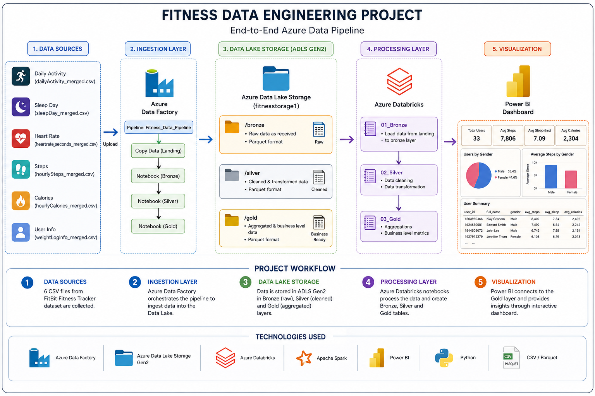
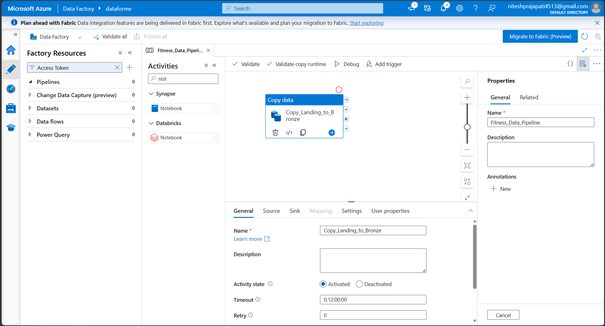
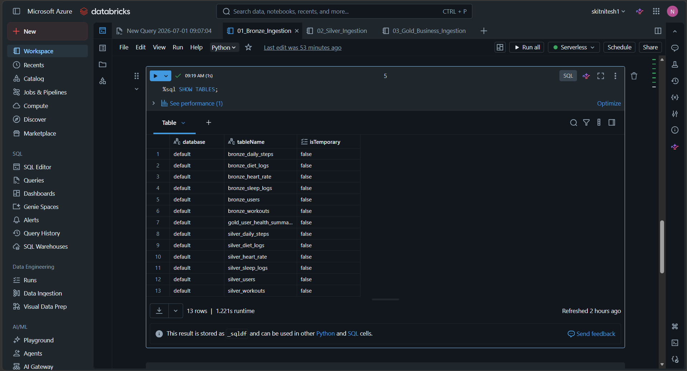
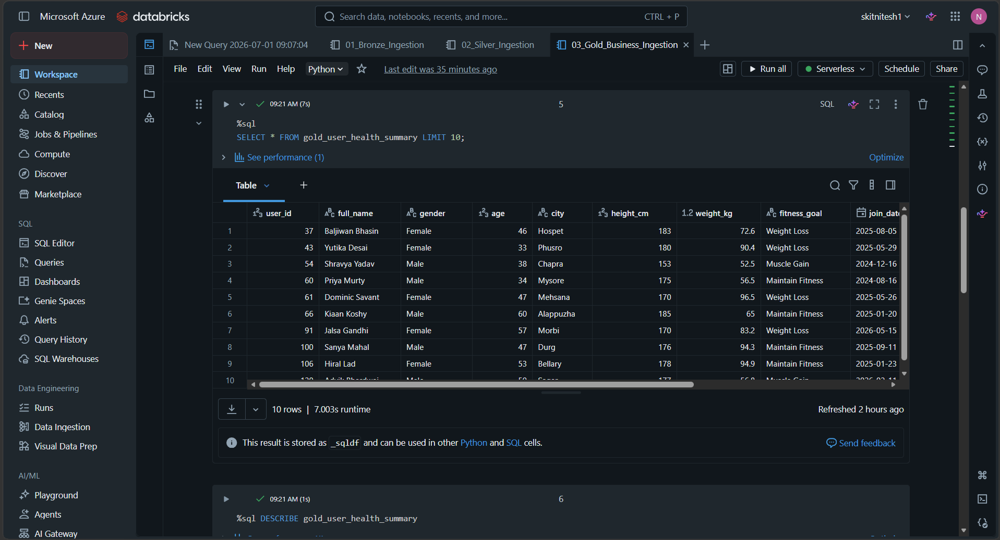
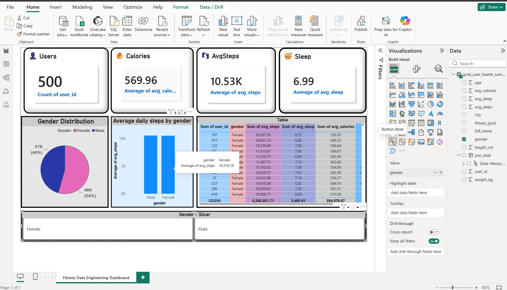

# 🏋️ Fitness Data Engineering Project

An End-to-End Azure Data Engineering Project implementing the **Medallion Architecture (Bronze → Silver → Gold)** for Fitness Data Analytics using Azure services, Databricks, PySpark, Delta Lake, Azure Data Factory and Power BI.

---

# 🚀 Tech Stack

| Technology | Purpose |
|------------|---------|
| Azure Data Lake Storage Gen2 | Data Storage |
| Azure Data Factory | Data Orchestration |
| Azure Databricks | Data Processing |
| PySpark | Data Transformation |
| Delta Lake | Storage Format |
| Power BI | Dashboard & Visualization |
| GitHub | Version Control |

---

# 📌 Project Architecture



---

# 📂 Project Structure

```
Fitness-App-Data-Engineering
│
├── datasets
│   ├── users.csv
│   ├── daily_steps.csv
│   ├── workouts.csv
│   ├── heart_rate.csv
│   ├── diet_logs.csv
│   └── sleep_logs.csv
│
├── scripts
│   └── dataset_generator.py
│
├── notebooks
│   ├── 01_Bronze.py
│   ├── 02_Silver.py
│   └── 03_Gold.py
│
├── powerbi
│   └── Fitness_Dashboard.pbix
│
├── images
│   ├── architecture.png
│   ├── adls.png
│   ├── adf_pipeline.png
│   ├── bronze_tables.png
│   ├── gold_table.png
│   └── powerbi_dashboard.png
│
├── README.md
├── requirements.txt
└── .gitignore
```

---

# 📊 Dataset

The project contains the following datasets:

- Users
- Daily Steps
- Workouts
- Heart Rate
- Diet Logs
- Sleep Logs

---

# 🗂 Azure Data Lake Storage

Raw CSV files are uploaded into Azure Data Lake Storage Gen2.

### Storage Structure

```
landing/
gold/
```

### Screenshot


---

# ⚙ Azure Data Factory Pipeline

Azure Data Factory orchestrates the complete ETL pipeline.

Pipeline Flow

```
CSV Files
      ↓
Landing
      ↓
Bronze
      ↓
Silver
      ↓
Gold
```

### Screenshot



---

# 🥉 Bronze Layer

### Tasks Performed

- Read Raw CSV Files
- Schema Inference
- Delta Table Creation
- Data Ingestion

### Screenshot



---

# 🥈 Silver Layer

### Data Cleaning

- Removed Duplicate Records
- Removed Invalid Values
- Handled Missing Values
- Standardized Data Types

---

# 🥇 Gold Layer

Business-ready data is generated for reporting.

Generated KPIs

- Average Daily Steps
- Average Sleep Hours
- Average Calories Intake
- Average Heart Rate
- Total Workout Duration

### Screenshot



---

# 📈 Power BI Dashboard

Interactive dashboard includes

✅ Total Users

✅ Average Steps

✅ Average Sleep Hours

✅ Average Calories

✅ Gender Distribution

✅ User Health Summary

### Dashboard



---

# 🔄 ETL Workflow

```
CSV Files
     │
     ▼
Azure Data Lake Storage
     │
     ▼
Azure Data Factory
     │
     ▼
Databricks Bronze Layer
     │
     ▼
Databricks Silver Layer
     │
     ▼
Databricks Gold Layer
     │
     ▼
Power BI Dashboard
```

---

# 📌 Business Insights

- User Activity Analysis
- Sleep Pattern Analysis
- Calories Consumption Analysis
- Workout Performance
- Gender-wise Fitness Comparison

---

# ▶ How to Run

1. Generate datasets using `dataset_generator.py`
2. Upload CSV files to Azure Data Lake Storage.
3. Execute Bronze Notebook.
4. Execute Silver Notebook.
5. Execute Gold Notebook.
6. Trigger Azure Data Factory Pipeline.
7. Open Power BI Dashboard.

---

# 📷 Project Screenshots

| Module | Screenshot |
|----------|------------|
| Azure Data Lake | ✅ |
| Azure Data Factory | ✅ |
| Databricks Bronze | ✅ |
| Databricks Gold | ✅ |
| Power BI Dashboard | ✅ |

---

# 👨‍💻 Author

Nitesh Prajapat

B.Tech CSE (Data Engineering Project)

---

# ⭐ If you like this project, give it a Star.